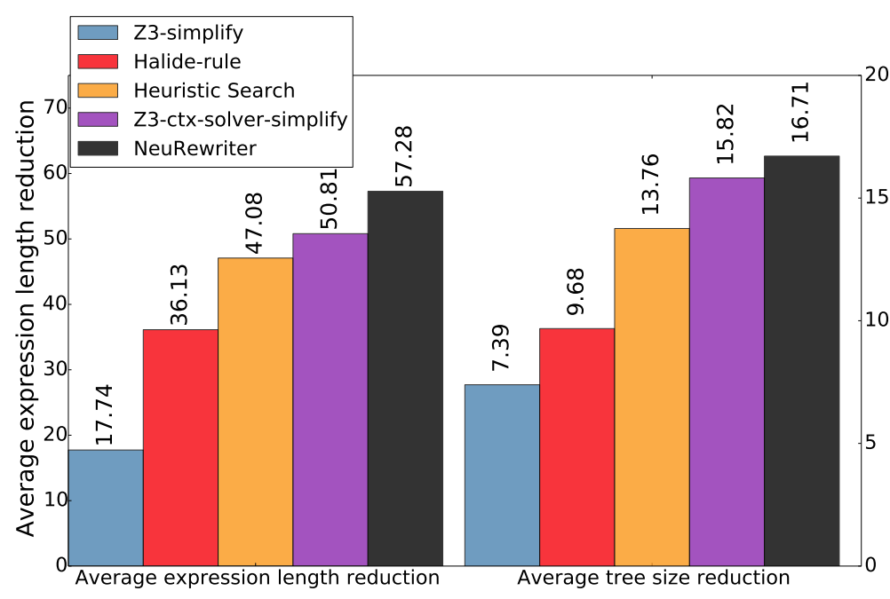
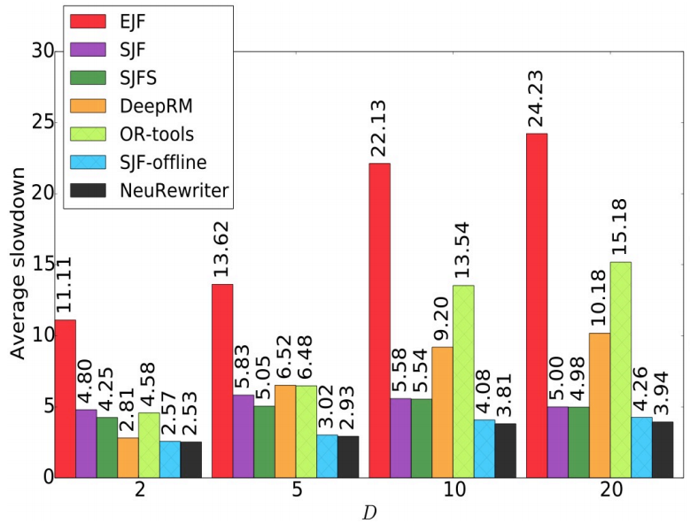
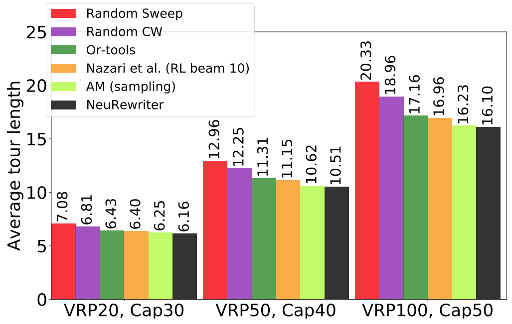

# Neural Rewriter

This repo provides the code to replicate the experiments in the paper

> Xinyun Chen, Yuandong Tian, <cite> Learning to Perform Local Rewriting for Combinatorial Optimization, in NeurIPS 2019. </cite>

Paper [[arXiv](https://arxiv.org/abs/1810.00337)] 

## Prerequisites

[PyTorch](https://pytorch.org)

## Tasks


### Expression Simplification

For expression simplification, given an initial expression (in Halide for our evaluation), the goal is to find an equivalent expression that is simplified, e.g., with a shorter length.

#### Performance



We compare our approach (NeuRewriter) with the following baselines:

* Z3-simplify [1]: the tactic implemented in Z3, which performs rule-based rewriting.
* Halide-rule [2]: the Halide rule-based rewriter.
* Heuristic search: beam search to find the shortest rewritten expression using the Halide rule set.
* Z3-ctx-solver-simplify [1]: the tactic implemented in Z3, which invokes a solver to find the simplified equivalent expression.

In the figure, ``Average expression length reduction`` is the decrease of the length defined as the number of characters in the expression, and ``Average tree size reduction`` is the number of nodes decreased from the initial expression parse tree to the rewritten one.

#### Dataset

We generate expressions in [Halide](https://github.com/Halide/Halide) using a [random pipeline generator](2https://github.com/halide/Halide/tree/new_autoschedule_with_new_simplifier/apps/random_pipeline). We obtain rewriting traces using the Halide rule-based rewriter [here](https://github.com/halide/Halide/blob/rl_simplifier_rules/test/correctness/rewriter.cpp).

#### Usage

The code includes the implementation of following approaches:

* Neural Rewriter (Ours): run ``run_Halide.py``.
* Search: run ``Halide_search.py``.

### Job Scheduling

For job scheduling, we have a machine with ``D`` types of resources, and a queue that can hold at most ``W=10`` pending jobs. Each job arrives in an online fashion, with a fixed resource demand and the duration. The goal is to minimize the average slowdown ``(Cj - Aj) / Tj``, where ``Cj`` is the completion time of job ``j``, ``Aj`` is the arrival time, and ``Tj`` is the job duration.

#### Performance



We compare our approach (NeuRewriter) with the following baselines:

* EJF: earliest job first, schedules each job in the increasing order of their arrival time.
* SJF: shortest job first, schedules the shortest job in the pending job queue.
* SJFS: shortest job first search, searches over the shortest jobs to schedule, then returns the optimal one.
* OR-tools [3]: a generic toolbox for combinatorial optimization.
* DeepRM [4]: a reinforcement learning policy to construct the schedule from scratch.
* SJF-offline: applies the shortest job first heuristic, and assumes an unbounded length of the job queue.

In the figure, ``D`` denotes the number of resource types.

#### Dataset

The dataset generator can be found under [this folder](./data_generator/).

#### Usage

The code includes the implementation of following approaches:

* Neural Rewriter (Ours): run ``run_jsp.py``.
* Baseline algorithms: run ``jsp_nonNN_baselines.py``, set `--alg` from `[SJF, EJF, random]`.

### Vehicle Routing

For vehicle routing, we have a single vehicle with limited capacity to satisfy the resource demands of a set of customer nodes. To do so, we need to construct multiple routes starting and ending at the depot, so that the resources delivered in each route do not exceed the vehicle capacity, while the total route length is minimized.

#### Performance



We compare our approach (NeuRewriter) with the following baselines:

* Random Sweep [5]: a classic heuristic for vehicle routing.
* Random CW [6]: Clarke-Wright savings heuristic for vehicle routing.
* OR-tools [3]: a generic toolbox for combinatorial optimization.
* Nazari et al. [7]: a reinforcement learning policy to construct the route from scratch.
* AM [8]: a reinforcement learning policy to construct the route from scratch.

In the figure, ``VRP X, CAP Y`` means that the number of customer nodes is ``X``, and the vehicle capacity is ``Y``. 

#### Dataset

The dataset generator can be found under [this folder](./data_generator/).

#### Usage

Run ``run_vrp.py``.

## Run experiments

In the following we list some important arguments for experiments using neural network models:
* `--train_dataset`, `--val_dataset`, `--test_dataset`: path to the training/validation/test datasets respectively.
* `--model_dir`: path to the directory that stores the models.
* `--log_name`: name of the log file.
* `--load_model`: path to the pretrained model (optional).
* `--eval`: adding this command will enable the evaluation mode; otherwise, the model will be trained by default.
* `--num_epochs`: number of training epochs. The default value is `10`, but usually 1 epoch is enough for a decent performance.
* `--eval_every_n EVAL_EVERY_N`: evaluating the model and saving checkpoints every `EVAL_EVERY_N` steps.
* `--max_eval_size MAX_EVAL_SIZE`: when the value is not `None`, when performing the validation during training, the model only evaluates the first `MAX_EVAL_SIZE` samples in the validation set. Setting it to a small value if the validation process takes long.

More details can be found in ``arguments.py``.

## Citation

If you use the code in this repo, please cite the following paper:

```
@inproceedings{chen2019learning,
  title={Learning to Perform Local Rewriting for Combinatorial Optimization},
  author={Chen, Xinyun and Tian, Yuandong},
  booktitle={Advances in Neural Information Processing Systems},
  year={2019}
}
```
## License
This repo is CC-BY-NC licensed, as found in the [LICENSE file](./LICENSE).

## References

[1] [Z3](https://github.com/Z3Prover/z3)

[2] [Halide](https://github.com/halide/Halide)

[3] [OR-tools](https://developers.google.com/optimization)

[4] Mao et al. Resource Management with Deep Reinforcement Learning. ACM HotNets 2016

[5] Wren and Holliday. Computer scheduling of vehicles from one or more depots
to a number of delivery points. Operational Research Quarterly, 1972.

[6] Clarke and Wright. Scheduling of vehicles from a central depot to a number of
delivery points. Operations research, 1964.

[7] Nazari et al. Reinforcement Learning for Solving the Vehicle Routing Problem. NeurIPS 2018.

[8] Kool et al. Attention, Learn to Solve Routing Problems! ICLR 2019.
